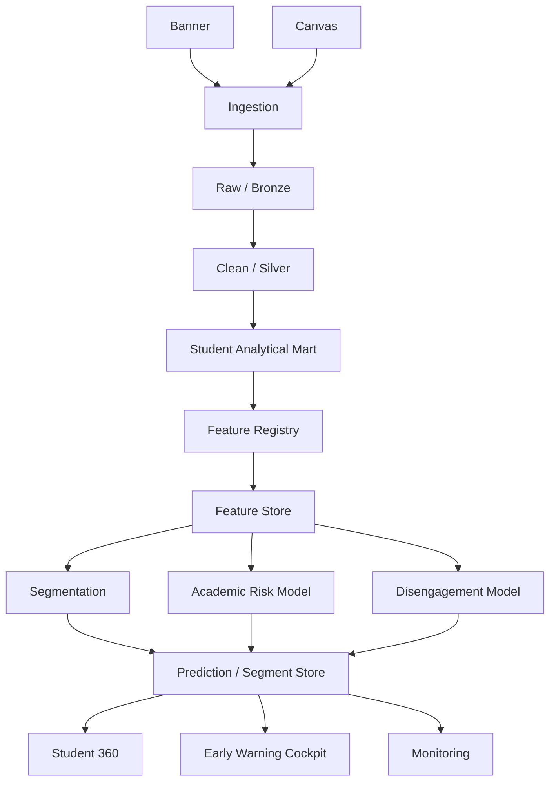
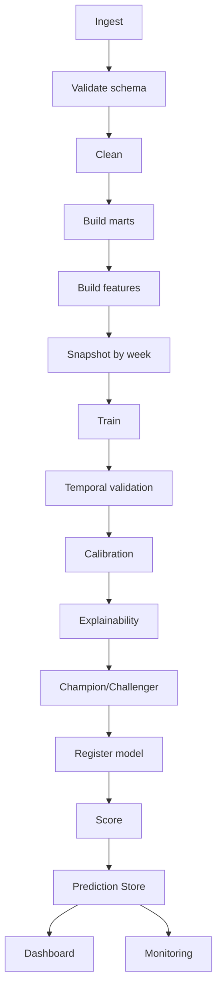

# Student Analytics UA — Documento Maestro de Contexto, Diseño y Desarrollo

**Proyecto:** Analítica de estudiantes — Universidad Autónoma de Chile  
**Propósito de este documento:** servir como **context pack / specification pack** para comenzar el desarrollo con Codex, Claude Code u otros agentes de programación, dejando definido el problema, la arquitectura, los datos mínimos, los datos a simular, los modelos, los criterios de evaluación, el producto final esperado, la gobernanza y una hoja de ruta incremental.

**Estado del documento:** versión inicial de trabajo para MVP/piloto.  
**Fecha:** septiembre de 2026.

---

# 0. Resumen ejecutivo

La Universidad Autónoma de Chile dispone de datos académicos y de interacción estudiantil provenientes principalmente de **Banner** y **Canvas**. El proyecto adjudicado plantea explotar estos datos para:

1. construir un **modelo de segmentación** de estudiantes;
2. identificar y priorizar **dos casos de uso predictivos** relevantes para las direcciones de carrera;
3. entrenar alternativas de modelos para cada caso;
4. seleccionar modelos ganadores;
5. publicar periódicamente resultados para las direcciones de carrera;
6. comenzar con un piloto en carreras de la **Facultad de Administración y Negocios** de las sedes Providencia, San Miguel, Talca y Temuco.

El propósito de este documento es elevar ese alcance desde “construir algunos modelos” hacia una **plataforma modular de Student Analytics**, que permita empezar con un conjunto pequeño de variables y crecer sin rehacer el producto.

La premisa arquitectónica central es:

> **La plataforma debe ser construida como una fábrica analítica extensible, no como un notebook cerrado.**

El MVP puede comenzar con 15–20 variables confiables, pero la solución debe soportar posteriormente 50, 100 o más variables sin cambiar su arquitectura conceptual.

El esqueleto mínimo debe contener:

- **Student Analytical Mart**
- **Feature Registry**
- **Feature Store**
- **Target Registry**
- **Model Training Pipeline**
- **Champion/Challenger framework**
- **Prediction Store**
- **Student 360**
- **Early Warning Cockpit**
- **Segmentation module**
- **Model Monitoring**
- **Data Quality Monitoring**
- **Governance / Model Cards**
- **Configuración declarativa** para agregar nuevas variables

El primer caso predictivo recomendado para el piloto es:

> **Riesgo de reprobación académica durante el semestre**, estimado tempranamente en semanas 3, 5, 8 y 12.

El segundo caso recomendado es:

> **Riesgo de desenganche académico / academic disengagement**, basado en asistencia, actividad Canvas, entregas, evaluaciones y deterioro de comportamiento.

La plataforma no debe limitarse a maximizar AUC. Debe optimizar un objetivo institucional más útil:

> **predecir suficientemente bien, suficientemente temprano, para que todavía exista tiempo de actuar.**

---

# 1. Base documental del proyecto

Este documento se construye a partir de tres insumos principales aportados al proyecto.

## 1.1 Postulación adjudicada — “Analítica de estudiantes”

La postulación establece que los cursos de la Universidad Autónoma de Chile generan datos en dos plataformas principales:

- Banner
- Canvas

Y menciona explícitamente, entre otros:

- cursos inscritos;
- cambios de asignaturas;
- asistencia;
- notas;
- entrega de tareas asignadas.

También señala que la VRA ya está consolidando datos para un dashboard y un modelo predictivo de deserción. Por esta razón, este documento propone que el nuevo producto **no duplique** ese trabajo, sino que se complemente con capacidades analíticas de mayor granularidad y accionabilidad.

El proyecto adjudicado contempla:

- un piloto en carreras seleccionadas de la Facultad de Administración y Negocios;
- participación de las cuatro sedes: Providencia, San Miguel, Talca y Temuco;
- construcción de al menos 3 alternativas de segmentación;
- priorización de 2 modelos predictivos;
- construcción de al menos 3 alternativas de modelamiento para cada caso predictivo;
- publicación periódica de resultados para las direcciones de carrera;
- implementación en una plataforma accesible al equipo, sin requerir un desarrollo mayor dentro de Banner.

## 1.2 Benchmark — Universidad de Los Lagos

El informe “Diseño y construcción de un modelo de detección temprana de deserción” aporta una lección metodológica muy relevante.

El trabajo de ULagos utilizó regresión logística sobre variables demográficas, socioeconómicas, académicas y de rendimiento. El resultado más importante para este proyecto es que:

- la información previa al ingreso tenía capacidad predictiva limitada para detectar deserción temprana;
- la incorporación de notas universitarias mejoraba sustancialmente el poder predictivo;
- el modelo al término del segundo semestre era más potente, pero para ese momento muchos estudiantes ya habían desertado;
- el informe recomienda mejorar la predicción temprana incorporando variables como:
  - notas parciales;
  - asistencia;
  - uso de plataformas virtuales;
  - uso de otros recursos institucionales.

El benchmark también utiliza **lift curves** y plantea la focalización de intervenciones como un problema práctico: no basta con saber quién tiene riesgo, sino que importa cuántos estudiantes deben ser priorizados para capturar una proporción relevante de los casos futuros.

## 1.3 Contexto del sistema de educación superior chileno

El documento sobre actualización de títulos y grados destaca:

- aumento y diversificación de la matrícula;
- mayor heterogeneidad etaria y socioeconómica;
- importancia de trayectorias formativas flexibles;
- necesidad de información comprensible para apoyar decisiones;
- necesidad de considerar trayectorias y no solo estados estáticos.

Esto refuerza la idea de modelar **trayectorias académicas y de engagement** y no solo perfiles demográficos.

---

# 2. Visión del producto

## 2.1 Nombre de trabajo

**Student Analytics UA**

Nombre alternativo técnico:

**Student Analytics Engine UA**

## 2.2 Definición

Student Analytics UA será una plataforma analítica que integre información académica, de trayectoria y de interacción digital para:

1. caracterizar a la población estudiantil;
2. segmentar trayectorias y perfiles de comportamiento;
3. detectar riesgo académico de forma temprana;
4. detectar señales de desenganche;
5. priorizar estudiantes para revisión por parte de direcciones de carrera;
6. explicar las causas principales de cada alerta;
7. monitorear la evolución del riesgo durante el semestre;
8. medir la calidad y estabilidad de los modelos;
9. crecer de forma incremental al incorporar nuevas variables y fuentes.

## 2.3 Principio de diseño

No se quiere construir:

> “un modelo con los datos disponibles hoy”.

Se quiere construir:

> “una plataforma cuyos modelos y productos se alimentan de un catálogo incremental de datos y features”.

## 2.4 Principio de decisión

La plataforma no debe presentar únicamente probabilidad de riesgo.

Debe responder:

- ¿quién necesita revisión?
- ¿qué tan urgente es?
- ¿qué cambió?
- ¿cuáles son los factores principales?
- ¿desde cuándo aumenta el riesgo?
- ¿en qué asignaturas ocurre?
- ¿qué capacidad de intervención tiene la dirección?
- ¿qué proporción de casos futuros se captura si se prioriza el top 5%, 10%, 20%?

---

# 3. Objetivos

## 3.1 Objetivo general

Diseñar e implementar un piloto extensible de Student Analytics para la Universidad Autónoma de Chile que permita caracterizar, segmentar y estimar riesgo académico temprano utilizando información académica y de interacción estudiantil.

## 3.2 Objetivos específicos

1. Construir un modelo de datos canónico para integrar Banner y Canvas.
2. Crear una capa analítica de estudiante × asignatura × semana.
3. Crear una capa agregada de estudiante × semana.
4. Diseñar un Feature Registry que permita incorporar nuevas variables declarativamente.
5. Construir un conjunto inicial de 15–20 features robustos.
6. Crear una segmentación interpretable de estudiantes.
7. Implementar un primer modelo predictivo de riesgo académico.
8. Implementar un segundo modelo predictivo de disengagement.
9. Validar temporalmente los modelos.
10. Implementar métricas de negocio, no solo métricas estadísticas.
11. Crear un Prediction Store histórico.
12. Crear un dashboard / cockpit de gestión.
13. Crear una vista Student 360.
14. Implementar trazabilidad de modelos y Model Cards.
15. Diseñar monitoreo de datos, drift y desempeño.
16. Crear un pipeline reproducible de entrenamiento, scoring y actualización.
17. Dejar una arquitectura preparada para incorporar nuevas fuentes y features sin rediseñar la plataforma.

---

# 4. Alcance del MVP

## 4.1 Población inicial recomendada

Facultad de Administración y Negocios.

Sedes:

- Providencia
- San Miguel
- Talca
- Temuco

## 4.2 Horizonte temporal

Se recomienda usar tantas cohortes históricas como sea posible, idealmente:

- 3 a 5 años para entrenamiento;
- 1 cohorte posterior para validación;
- cohorte más reciente como test temporal.

Si solo se dispone de menos años, adaptar el diseño sin reemplazar la validación temporal por random split como criterio principal.

## 4.3 Frecuencia

MVP:

- scoring semanal.

Producto futuro:

- scoring diario o near-real-time para algunas señales Canvas.

## 4.4 Casos de uso iniciales

### Caso 1 — Riesgo de reprobación

Predicción de:

- reprobación de al menos una asignatura;
- o versión alternativa: reprobación de dos o más asignaturas.

Scoring:

- semana 3;
- semana 5;
- semana 8;
- semana 12.

### Caso 2 — Academic disengagement

Señales:

- caída sostenida de asistencia;
- menor actividad Canvas;
- tareas no entregadas;
- evaluaciones no rendidas;
- deterioro de notas;
- retiro de asignaturas;
- ausencia prolongada.

Este caso puede ser modelado como:
- clasificación;
- score compuesto;
- evento temporal;
- o modelo de supervivencia/hazard.

---

# 5. Unidades analíticas

La plataforma debe mantener dos unidades principales.

## 5.1 Student × Course × Week

Grano:

`student_id + course_id + academic_period + week`

Permite:

- riesgo por asignatura;
- monitoreo de asistencia;
- comportamiento Canvas;
- evolución de notas;
- entregas;
- dificultad del curso;
- interacción con el docente/curso.

## 5.2 Student × Week

Grano:

`student_id + academic_period + week`

Permite:

- riesgo general;
- agregación de asignaturas;
- identificación de carga crítica;
- número de cursos en riesgo;
- tendencia general;
- segmentación;
- Student 360.

---

# 6. Dominios de datos

La plataforma debe organizar variables por dominios.

## 6.1 Identificación y estructura

Variables:

- student_id pseudonimizado
- academic_period
- cohort
- campus
- faculty
- career
- study_plan
- course_id
- course_name
- section
- teacher_id pseudonimizado
- week
- semester_number
- academic_year

Uso:

- filtros;
- validación;
- segmentación;
- control de heterogeneidad;
- análisis por sede/carrera/asignatura.

---

# 7. Trayectoria académica

Variables iniciales:

- n_courses_enrolled
- credits_enrolled
- n_courses_withdrawn
- credits_passed_previous
- credits_failed_previous
- historical_pass_rate
- curriculum_progress_pct
- repeated_courses_count

Features derivadas:

```text
historical_pass_rate =
credits_passed_previous /
max(credits_attempted_previous, 1)
```

```text
course_withdrawal_rate =
withdrawn_courses /
max(enrolled_courses, 1)
```

Variables futuras:

- career_changes
- interruptions
- semesters_enrolled
- prerequisite_failures
- curricular_delay
- excess_semesters
- credit_load_relative_to_plan

---

# 8. Rendimiento académico

Variables MVP:

- current_average_grade
- last_grade
- minimum_grade
- maximum_grade
- assessments_completed
- assessments_failed
- assessments_missing
- first_assessment_grade

Features de trayectoria:

- grade_delta
- rolling_grade_mean
- rolling_grade_std
- grade_trend
- percentile_in_course
- zscore_in_course

Ejemplo:

```text
grade_delta =
mean(last_n_grades) - mean(previous_n_grades)
```

Interpretación:

- estudiante estable en 4.2 ≠ estudiante que cae de 5.8 a 4.2.

La tendencia puede ser más predictiva que el nivel absoluto.

---

# 9. Asistencia

Variables MVP:

- attendance_cumulative
- attendance_last_7d
- attendance_last_14d
- absences_consecutive
- classes_attended
- classes_scheduled

Features:

```text
attendance_delta_14d =
attendance_last_14d - attendance_cumulative_prior
```

```text
absence_streak =
máximo número de inasistencias consecutivas
```

```text
attendance_volatility =
std(attendance weekly)
```

Variables de alerta:

- attendance_below_50
- attendance_below_70
- sharp_attendance_drop

---

# 10. Entregas y tareas

Variables MVP:

- assignments_assigned
- assignments_submitted
- assignments_missing
- assignments_late
- submission_rate
- late_rate

Fórmulas:

```text
submission_rate =
assignments_submitted /
max(assignments_assigned, 1)
```

```text
late_rate =
assignments_late /
max(assignments_submitted, 1)
```

Features futuras:

- mean_submission_delay_hours
- consecutive_missing_assignments
- assignment_completion_trend

---

# 11. Engagement Canvas

Estas variables deben ser verificadas contra lo que Canvas entregue de forma consistente.

Candidatos:

- logins_7d
- logins_14d
- active_days_7d
- active_days_14d
- page_views_7d
- page_views_14d
- sessions_7d
- days_since_last_activity
- materials_viewed
- discussion_posts
- discussion_replies

Features:

- delta_logins
- delta_page_views
- delta_active_days
- engagement_trend
- engagement_volatility

Ejemplo:

```text
engagement_drop =
activity_last_7d / max(activity_previous_7d, epsilon) - 1
```

---

# 12. Variables previas al ingreso

No deben ser el núcleo del modelo, pero sirven como contexto, baseline y análisis de fairness.

Posibles variables:

- admission_type
- NEM
- ranking
- PAES/PSU
- preference_order
- high_school_type
- year_high_school_graduation
- benefit_type
- gratuidad
- scholarships

Importante:

- no asumir que estas variables serán altamente predictivas;
- usarlas como baseline;
- evaluar su aporte incremental;
- evitar que el modelo dependa excesivamente de características sensibles o difíciles de justificar operacionalmente.

---

# 13. Variables contextuales de asignatura

Una de las extensiones más valiosas del MVP.

## 13.1 Historical Course Fail Rate

```text
course_fail_rate =
historical_failed_students /
historical_students
```

## 13.2 Course Difficulty Index

Posible combinación de:

- fail rate;
- withdrawal rate;
- grade dispersion;
- historical mean grade.

## 13.3 Academic Load Risk

```text
academic_load_risk =
sum(course_credits * historical_course_fail_rate)
```

Esta feature permite distinguir cargas académicas estructuralmente distintas.

---

# 14. Variables de trayectoria dinámica

La plataforma debe priorizar features de cambio.

Familia genérica:

- level
- delta
- slope
- volatility
- recency

Para cualquier variable `x`:

```text
x_level
x_delta_1w
x_delta_2w
x_slope_4w
x_std_4w
x_days_since_event
```

Este patrón debe ser configurable y reutilizable.

---

# 15. Set mínimo recomendado para el piloto

El MVP puede comenzar con aproximadamente 20 variables.

## 15.1 Identificación

- campus
- career
- cohort
- course_id
- week

## 15.2 Trayectoria

- credits_enrolled
- historical_failed_courses
- historical_pass_rate

## 15.3 Asistencia

- attendance_cumulative
- attendance_last_14d
- attendance_delta_14d
- absences_consecutive

## 15.4 Rendimiento

- current_average_grade
- last_grade
- failed_assessments
- grade_delta

## 15.5 Canvas / entregas

- submission_rate
- assignments_missing
- assignments_late
- days_since_last_activity
- activity_last_7d
- activity_delta_7d

Con esto ya es posible construir un piloto robusto.

---

# 16. Targets

La definición de target debe ser formal, versionada y auditada.

## 16.1 Target Registry

Ejemplo conceptual:

```yaml
targets:
  fail_any_course:
    version: 1
    unit: student_period
    definition: "1 si el estudiante reprueba >=1 asignatura al cierre del periodo"
    horizon: "end_of_term"

  fail_two_or_more:
    version: 1
    unit: student_period
    definition: "1 si el estudiante reprueba >=2 asignaturas al cierre del periodo"

  course_failure:
    version: 1
    unit: student_course_period
    definition: "1 si el estudiante reprueba la asignatura"

  disengagement:
    version: 1
    unit: student_week
    definition: "evento compuesto sujeto a validación institucional"
```

## 16.2 Prevención de leakage

Para cada semana `t`:

- solo pueden utilizarse datos disponibles hasta `t`;
- no se pueden incorporar notas finales;
- no se pueden incorporar estados posteriores;
- no se puede usar información creada como consecuencia del evento objetivo.

Ejemplo:

```text
features <= semana 4
target = resultado cierre semestre
```

---

# 17. Diseño temporal

Debe existir un modelo o snapshot por horizonte.

```text
T0      ingreso
W3      semana 3
W5      semana 5
W8      semana 8
W12     semana 12
FINAL   resultado
```

Comparar:

- poder predictivo;
- capacidad de focalización;
- anticipación.

Concepto clave:

```text
Operational Value =
Predictive Performance × Intervention Lead Time
```

No es una fórmula obligatoria, sino un principio de diseño.

---

# 18. Datos a simular para iniciar desarrollo

Antes de recibir datos reales, se recomienda crear un generador sintético.

Objetivos:

- probar arquitectura;
- desarrollar dashboards;
- construir tests;
- validar pipelines;
- experimentar con modelos;
- preparar integración real.

## 18.1 Volumen recomendado

Para el piloto sintético:

- 10.000 estudiantes históricos;
- 4 sedes;
- 8–15 carreras;
- 40–80 asignaturas;
- 18 semanas por semestre;
- 6 semestres históricos;
- 4–6 asignaturas por estudiante/semestre.

Esto puede generar entre 1 y 3 millones de registros Student × Course × Week sin ser excesivo.

## 18.2 Distribución sintética sugerida

### Campus

- Providencia: 30%
- San Miguel: 30%
- Talca: 20%
- Temuco: 20%

### Estudiantes por carrera

Simular tamaños heterogéneos.

### Notas

Escala chilena:

- 1.0 a 7.0;
- aprobación típica: 4.0.

Simular:

- media por estudiante;
- efecto curso;
- efecto trayectoria;
- deterioro dinámico.

### Asistencia

0–100%.

Simular perfiles:

- estable alta;
- estable media;
- caída progresiva;
- ausencias abruptas.

### Canvas

Simular:

- actividad base por estudiante;
- actividad por curso;
- tendencia semanal;
- caída antes del evento;
- variabilidad individual.

### Entregas

Simular:

- submission_rate;
- missing assignments;
- late assignments.

## 18.3 Tipos de estudiantes sintéticos

Crear perfiles latentes para que el modelo tenga patrones realistas.

### Perfil A — High performer

- buena asistencia;
- alta entrega;
- notas altas;
- engagement estable.

### Perfil B — Silent high performer

- notas altas;
- bajo Canvas;
- alta autonomía.

### Perfil C — Struggling engaged

- alta participación;
- notas bajas;
- alta entrega.

### Perfil D — Academic risk

- notas bajas;
- evaluaciones reprobadas;
- asistencia media.

### Perfil E — Disengaging

- empieza bien;
- cae asistencia;
- cae actividad;
- aumentan tareas faltantes.

### Perfil F — Intermittent

- alta volatilidad;
- semanas de desconexión.

### Perfil G — Recovering

- riesgo inicial;
- mejora sostenida.

## 18.4 Generación del target sintético

No generar un target puramente aleatorio.

Ejemplo conceptual:

```text
latent_risk =
  + low_grade_effect
  + attendance_drop_effect
  + missing_assignments_effect
  + canvas_drop_effect
  + historical_failure_effect
  + course_difficulty_effect
  + noise
```

Luego:

```text
p_failure = sigmoid(latent_risk)
failure ~ Bernoulli(p_failure)
```

El generador debe permitir modificar coeficientes para probar robustez.

---

# 19. Diccionario de datos sintético mínimo

## 19.1 student_master.csv

Columnas:

```text
student_id
cohort
campus
faculty
career
study_plan
admission_type
nem_score
ranking_score
admission_score
benefit_flag
historical_pass_rate
historical_failed_courses
```

## 19.2 course_master.csv

```text
course_id
course_name
career
semester_number
credits
historical_fail_rate
historical_withdraw_rate
difficulty_index
```

## 19.3 enrollment.csv

```text
student_id
academic_period
course_id
section_id
enrollment_status
enrollment_date
withdrawal_date
```

## 19.4 attendance_weekly.csv

```text
student_id
course_id
academic_period
week
classes_scheduled
classes_attended
attendance_week
attendance_cumulative
```

## 19.5 grades_weekly.csv

```text
student_id
course_id
academic_period
week
assessments_completed
assessments_failed
last_grade
current_average_grade
```

## 19.6 canvas_weekly.csv

```text
student_id
course_id
academic_period
week
logins_7d
active_days_7d
page_views_7d
sessions_7d
days_since_last_activity
```

## 19.7 assignments_weekly.csv

```text
student_id
course_id
academic_period
week
assignments_assigned
assignments_submitted
assignments_missing
assignments_late
submission_rate
```

## 19.8 outcomes.csv

```text
student_id
course_id
academic_period
final_grade
course_passed
course_failed
course_withdrawn
```

## 19.9 student_outcomes.csv

```text
student_id
academic_period
failed_any_course
failed_two_or_more
failed_courses_count
credits_passed
credits_failed
```

---

# 20. Modelo de datos canónico

## 20.1 Dimensiones

### dim_student

```text
student_sk
student_id_hash
cohort
campus
faculty
career
study_plan
```

### dim_course

```text
course_sk
course_id
course_name
career
credits
semester_number
```

### dim_period

```text
period_sk
academic_year
semester
start_date
end_date
```

### dim_week

```text
week_sk
period_sk
week_number
week_start
week_end
```

## 20.2 Facts

### fact_enrollment

```text
student_sk
course_sk
period_sk
enrollment_status
```

### fact_academic_week

```text
student_sk
course_sk
period_sk
week_sk
attendance
grade
assignments
```

### fact_canvas_week

```text
student_sk
course_sk
period_sk
week_sk
logins
page_views
active_days
```

### fact_outcome

```text
student_sk
course_sk
period_sk
final_grade
pass_flag
withdraw_flag
```

---

# 21. Student Analytical Mart

## 21.1 mart_student_course_week

Grano:

```text
student_id
course_id
period
week
```

Incluye:

- estructura;
- trayectoria;
- attendance;
- grades;
- assignments;
- Canvas;
- context features;
- targets cuando corresponda.

## 21.2 mart_student_week

Agregaciones recomendadas:

```text
courses_enrolled
courses_at_risk
credits_enrolled
mean_grade
min_grade
mean_attendance
min_attendance
submission_rate
missing_assignments
canvas_activity
days_since_last_activity
academic_load_risk
```

---

# 22. Feature Registry

Es la pieza central de extensibilidad.

Ejemplo:

```yaml
features:

  attendance_14d:
    source: attendance
    entity: student_course_week
    dtype: float
    aggregation: mean
    window: 14d
    enabled: true
    allowed_models:
      - academic_risk
      - disengagement
    dashboard:
      visible: true
      label: "Asistencia últimas 2 semanas"
      format: percentage
    quality:
      min: 0
      max: 1
      max_missing_pct: 0.05

  grade_delta:
    source: grades
    entity: student_course_week
    dtype: float
    transformation: grade_delta
    enabled: true

  canvas_activity_7d:
    source: canvas
    entity: student_course_week
    dtype: float
    enabled: false
```

Al recibir una nueva variable:

1. se incorpora al origen;
2. se registra;
3. se habilita;
4. QA;
5. feature engineering;
6. entrenamiento challenger;
7. evaluación;
8. promoción si mejora.

---

# 23. Feature Store

Objetivo:

- almacenar features calculados;
- evitar recálculo inconsistente;
- separar feature engineering del modelado;
- soportar versiones.

Tabla conceptual:

```text
student_id
course_id
period
week
feature_set_version
feature_001
feature_002
...
```

Para MVP, puede implementarse en:

- PostgreSQL;
- DuckDB/Parquet;
- SQL Server si es más natural para el entorno institucional.

No es obligatorio usar una plataforma especializada de feature store en la primera versión.

---

# 24. Prediction Store

Nunca sobrescribir predicciones anteriores.

Schema:

```text
prediction_id
student_id
course_id nullable
period
week
model_name
model_version
score_date
risk_score
risk_band
top_driver_1
top_driver_2
top_driver_3
feature_set_version
```

Esto habilita:

- trayectoria de riesgo;
- backtesting;
- auditoría;
- monitoreo;
- comparación de versiones.

---

# 25. Segmentación

La segmentación no debe ser solo una competencia de algoritmos.

Objetivo:

> encontrar grupos interpretables con diferencias relevantes para gestión académica.

## 25.1 Algoritmos candidatos

Cumpliendo el requisito de 3 alternativas:

1. K-Means
2. Gaussian Mixture Model
3. Hierarchical Clustering

Opcionales:

- HDBSCAN
- K-Prototypes si hay muchas variables categóricas

## 25.2 Variables sugeridas

- grade_level
- grade_trend
- attendance_level
- attendance_trend
- submission_rate
- missing_assignments
- Canvas activity
- Canvas trend
- historical pass rate
- academic load risk

## 25.3 Evaluación

No usar solo silhouette.

Evaluar:

- estabilidad temporal;
- tamaño de clusters;
- separabilidad;
- interpretabilidad;
- persistencia;
- utilidad operacional.

## 25.4 Taxonomía posible

- High performer
- Silent high performer
- Struggling engaged
- Academic risk
- Disengaging
- Intermittent
- Recovering

Los nombres deben ser validados institucionalmente.

---

# 26. Modelos predictivos

## 26.1 Baseline obligatorio

Logistic Regression.

Ventajas:

- interpretabilidad;
- benchmark;
- estabilidad;
- comparación con literatura.

## 26.2 ML tabular

Candidatos:

- Random Forest
- XGBoost
- LightGBM
- CatBoost

Para MVP:

- Logistic Regression
- Random Forest
- CatBoost o XGBoost

## 26.3 Modelos temporales futuros

- discrete-time survival
- Cox model
- gradient boosted survival
- temporal neural networks, solo si el volumen y beneficio lo justifican

No empezar con deep learning.

---

# 27. Validación

## 27.1 Regla principal

**No usar random train/test split como validación principal.**

## 27.2 Diseño recomendado

Ejemplo:

```text
Train      2022–2024
Validation 2025
Test       2026
```

O:

```text
Train cohort 2023
Validation cohort 2024
Test cohort 2025
```

## 27.3 Backtesting por semana

Evaluar modelos independientes por snapshot:

- W3
- W5
- W8
- W12

---

# 28. Métricas

## 28.1 Métricas estadísticas

- ROC-AUC
- PR-AUC
- Log Loss
- Brier Score
- calibration slope/intercept

## 28.2 Métricas de focalización

- Precision@5%
- Precision@10%
- Precision@20%
- Recall@5%
- Recall@10%
- Recall@20%
- Lift@5%
- Lift@10%
- Lift@20%

```text
Lift@k =
Precision@k /
BaseEventRate
```

## 28.3 Métricas institucionales

Ejemplo:

```text
Si la dirección puede revisar 100 estudiantes:
¿cuántos futuros casos de riesgo están dentro del top 100?
```

Esto debe convertirse en una métrica de negocio.

---

# 29. Calibration

Una probabilidad debe significar algo.

Si el modelo asigna 0.70:

- idealmente, un grupo de estudiantes con score cercano a 0.70 debería presentar una tasa real cercana a 70%.

Evaluar:

- calibration curve;
- Brier Score;
- Expected Calibration Error;
- isotonic/platt calibration si es necesario.

---

# 30. Risk Bands

No fijar bandas definitivas sin analizar datos.

Ejemplo inicial de UI:

```text
Low
Medium
High
Critical
```

Las bandas deben basarse en:

- distribución;
- capacidad operativa;
- tasa de evento;
- objetivos institucionales.

Una alternativa mejor es usar percentiles:

- Top 5%
- Top 10%
- Top 20%

---

# 31. Explainability

Cada predicción debe presentar factores comprensibles.

Ejemplo:

```text
Risk Score: 0.82

Drivers:
- asistencia últimas 2 semanas: 48%
- actividad Canvas: -41%
- 3 tareas no entregadas
- nota promedio actual: 3.6
```

Internamente pueden utilizarse:

- SHAP
- feature importance
- coefficients
- local explanations

Pero la interfaz no debe mostrar solo valores técnicos sin traducción.

---

# 32. Model Registry

Tabla:

```text
model_id
model_name
version
target
feature_set_version
algorithm
train_period
validation_period
test_period
created_at
status
```

Estados:

- experimental
- challenger
- champion
- retired

---

# 33. Model Card

Cada modelo debe tener:

- propósito;
- población;
- target;
- horizonte;
- variables;
- exclusiones;
- algoritmo;
- entrenamiento;
- validación;
- métricas;
- calibration;
- fairness;
- limitaciones;
- supuestos;
- fecha de entrenamiento;
- responsable;
- versión;
- retraining policy.

---

# 34. Champion / Challenger

Cuando se agrega una feature:

1. el modelo actual permanece champion;
2. se entrena challenger;
3. se compara temporalmente;
4. se verifica calibration;
5. se verifica estabilidad;
6. se revisa fairness;
7. se promueve solo si cumple criterios.

Nunca desplegar automáticamente una versión nueva solo porque su AUC aumentó marginalmente.

---

# 35. Arquitectura lógica



---

# 36. Capas

## 36.1 Bronze

Datos casi originales.

Objetivos:

- preservar trazabilidad;
- auditoría;
- reproducibilidad.

## 36.2 Silver

Datos:

- tipificados;
- deduplicados;
- estandarizados;
- con claves resueltas.

## 36.3 Gold

Data marts y features listos para análisis/modelos.

---

# 37. Data Quality Framework

Cada fuente debe ser validada.

## 37.1 Reglas

- completeness
- uniqueness
- validity
- consistency
- timeliness
- referential integrity

## 37.2 Ejemplos

```text
attendance ∈ [0,1]
grade ∈ [1,7]
week ∈ [1,20]
student_id no nulo
course_id no nulo
```

## 37.3 Monitoreo

Registrar:

- missing rate;
- duplicates;
- distribution shift;
- row counts;
- freshness;
- invalid values.

---

# 38. Data Contracts

Para cada fuente:

```yaml
source: canvas_activity
owner: TBD
refresh: daily
primary_keys:
  - student_id
  - course_id
  - date
required_fields:
  - student_id
  - course_id
  - event_timestamp
sla:
  max_delay_hours: 24
```

Los contratos reducen sorpresas cuando las fuentes cambian.

---

# 39. Producto final — módulos

## 39.1 Student Overview

Objetivo:

visión general.

Indicadores:

- estudiantes activos;
- estudiantes high risk;
- cambio semanal;
- distribución por sede;
- distribución por carrera;
- riesgo por cohorte;
- tendencia temporal.

Filtros:

- campus;
- faculty;
- career;
- cohort;
- period;
- week.

---

# 40. Early Warning Cockpit

Tabla priorizada:

```text
student_id
risk_score
risk_delta
risk_band
courses_at_risk
top_driver
last_activity
```

Funciones:

- ordenar por riesgo;
- filtrar por capacidad;
- top 50 / 100 / 200;
- exportar lista;
- ver Student 360.

---

# 41. Student 360

Debe mostrar:

## Identificación académica

- carrera;
- sede;
- cohorte;
- periodo.

## Riesgo

- score actual;
- score semana anterior;
- variación;
- percentil.

## Trayectoria

- riesgo por semana.

## Drivers

- top 3–5 factores.

## Académico

- promedio;
- asignaturas críticas;
- evaluaciones;
- créditos.

## Engagement

- asistencia;
- tareas;
- Canvas.

---

# 42. Risk Trajectory

Ejemplo:

```text
Week       1   2   3   4   5   6
Risk      .18 .22 .29 .38 .61 .84
```

Esta trayectoria debe ser persistida.

---

# 43. Segmentation View

Visualizaciones:

- distribución de segmentos;
- evolución;
- promedio de variables por segmento;
- tasa de evento;
- campus/carrera;
- matriz rendimiento × engagement.

---

# 44. Model Monitoring

Dashboard técnico.

Mostrar:

- modelo activo;
- versión;
- fecha de entrenamiento;
- AUC;
- PR-AUC;
- Brier;
- Recall@10%;
- Lift@10%;
- calibration;
- drift;
- feature health.

---

# 45. Fairness / análisis de estabilidad entre grupos

Cuando sea institucional y metodológicamente pertinente, comparar:

- TPR
- FPR
- Precision
- calibration

entre:

- sedes;
- carreras;
- cohortes;
- grupos que la Universidad determine legal y éticamente que pueden ser auditados.

Objetivo:

detectar diferencias de desempeño.

No usar automáticamente características sensibles como causa de priorización.

---

# 46. Seguridad y privacidad

Principios:

1. pseudonimización en ambientes analíticos;
2. mínimo privilegio;
3. control de acceso por rol;
4. no exponer información innecesaria;
5. logs de acceso;
6. separación desarrollo/producción;
7. no entrenar modelos externos con datos identificables sin autorización;
8. revisión por responsables institucionales;
9. cumplimiento de normativa chilena de protección de datos aplicable y políticas internas vigentes.

El producto debe ser diseñado como sistema de **apoyo a decisiones**, no como mecanismo automático de sanción.

---

# 47. Roles

## Dirección de carrera

Acceso:

- población de su carrera;
- alertas;
- Student 360;
- segmentación.

## Autoridad facultad

Acceso:

- agregados;
- comparaciones;
- tendencias.

## Equipo analítico

Acceso:

- datos pseudonimizados;
- modelos;
- monitoreo;
- QA.

## Administrador

- configuración;
- usuarios;
- permisos.

---

# 48. Backend recomendado

MVP pragmático:

- Python 3.12+
- Pandas o Polars
- DuckDB
- Parquet
- PostgreSQL o SQL Server
- scikit-learn
- XGBoost / CatBoost
- SHAP
- FastAPI
- Pydantic
- MLflow opcional
- Great Expectations o Pandera
- Streamlit para MVP rápido

Si la Universidad ya dispone de infraestructura SQL Server, aprovecharla.

---

# 49. Frontend

MVP:

- Streamlit

Ventajas:

- rápido;
- Python end-to-end;
- adecuado para piloto.

Evolución:

- React/Next.js + FastAPI
- Power BI / Looker / Tableau si la Universidad prefiere herramientas BI.

La arquitectura debe separar backend analítico de UI para poder reemplazar Streamlit posteriormente.

---

# 50. Repository Structure

```text
student-analytics-ua/

README.md
pyproject.toml
.env.example
.gitignore

config/
    settings.yml
    features.yml
    targets.yml
    models.yml
    data_contracts.yml

data/
    raw/
    bronze/
    silver/
    gold/
    synthetic/

src/
    student_analytics/
        __init__.py

        ingestion/
            banner.py
            canvas.py

        quality/
            checks.py
            contracts.py

        transforms/
            academic.py
            attendance.py
            canvas.py
            assignments.py

        features/
            registry.py
            builders.py
            temporal.py

        marts/
            student_course_week.py
            student_week.py

        segmentation/
            train.py
            evaluate.py
            profiles.py

        modeling/
            datasets.py
            train.py
            evaluate.py
            calibration.py
            explain.py
            registry.py

        scoring/
            batch.py
            risk_bands.py

        monitoring/
            drift.py
            performance.py
            data_quality.py

        synthetic/
            generator.py
            profiles.py

        api/
            main.py
            schemas.py
            routes/

        ui/
            app.py
            pages/

tests/
    unit/
    integration/
    data_quality/
    modeling/

notebooks/
    01_eda.ipynb
    02_segmentation.ipynb
    03_model_baseline.ipynb

scripts/
    generate_synthetic.py
    build_marts.py
    train_models.py
    score_week.py

docs/
    architecture.md
    data_dictionary.md
    model_cards/
```

Los notebooks son exploratorios. La lógica productiva debe vivir en `src/`.

---

# 51. Configuración de modelos

Ejemplo:

```yaml
models:

  academic_risk:
    target: fail_any_course
    horizons:
      - 3
      - 5
      - 8
      - 12

    candidates:
      logistic:
        enabled: true

      random_forest:
        enabled: true

      catboost:
        enabled: true

    primary_metric: recall_at_10pct

    secondary_metrics:
      - pr_auc
      - lift_at_10pct
      - brier_score
```

---

# 52. Pipeline completo



---

# 53. Retraining policy

MVP:

- manual/on-demand;
- al incorporar nuevas features;
- al cerrar un periodo académico.

Futuro:

- programado por semestre;
- activado por drift;
- activado por deterioro de métricas.

---

# 54. Monitoring de datos

Por cada corrida:

```text
rows
students
courses
missing_pct
duplicate_pct
freshness
feature distributions
```

Comparar con histórico.

---

# 55. Feature Drift

Métricas posibles:

- PSI
- KS statistic
- Wasserstein distance

No activar retraining automáticamente por un único umbral.

Usar como señal.

---

# 56. Performance Drift

Cuando el outcome real esté disponible:

- ROC-AUC
- PR-AUC
- Recall@K
- Lift@K
- Brier
- Calibration

por:

- semana;
- sede;
- carrera;
- cohorte.

---

# 57. API mínima

Endpoints conceptuales:

```text
GET /health
GET /students
GET /students/{id}
GET /students/{id}/risk-history
GET /risk/top
GET /segments
GET /models
GET /models/{id}
POST /score
```

---

# 58. Tests

## Unit tests

- transforms;
- feature builders;
- targets;
- risk bands.

## Data quality

- schemas;
- ranges;
- nulls;
- keys.

## Integration

- synthetic → marts;
- marts → features;
- features → model;
- model → prediction store.

## Model tests

- no leakage;
- temporal split;
- minimum metric;
- deterministic seed;
- calibration bounds.

---

# 59. Acceptance criteria del MVP

## Datos

- [ ] carga reproducible de datos sintéticos;
- [ ] esquema validado;
- [ ] Student Course Week Mart;
- [ ] Student Week Mart;
- [ ] Feature Registry funcional.

## Modelos

- [ ] 3 alternativas segmentación;
- [ ] 3 algoritmos caso predictivo 1;
- [ ] validación temporal;
- [ ] Recall@K;
- [ ] Lift@K;
- [ ] calibration;
- [ ] Model Card.

## Producto

- [ ] Overview;
- [ ] Early Warning;
- [ ] Student 360;
- [ ] Segmentación;
- [ ] Monitoring básico.

## Extensibilidad

- [ ] agregar una feature mediante configuración;
- [ ] pipeline la incorpora;
- [ ] challenger se reentrena;
- [ ] dashboard puede mostrarla si `visible=true`.

---

# 60. Roadmap recomendado

## Fase 0 — Contextualización

- validar alcance;
- definir responsables;
- confirmar fuentes;
- definir permisos;
- confirmar disponibilidad histórica.

## Fase 1 — Esqueleto técnico

- repo;
- config;
- synthetic generator;
- schemas;
- marts;
- tests.

## Fase 2 — Datos reales

- integración Banner;
- integración Canvas;
- data quality;
- data dictionary.

## Fase 3 — Segmentación

- 3 modelos;
- evaluación;
- perfiles.

## Fase 4 — Modelo 1

- baseline;
- RF;
- CatBoost/XGBoost;
- temporal validation;
- calibration;
- lift.

## Fase 5 — Producto

- scoring;
- prediction store;
- dashboard;
- Student 360.

## Fase 6 — Modelo 2

- disengagement;
- dinámica temporal.

## Fase 7 — Monitoring

- data health;
- model performance;
- drift.

---

# 61. Hoja de ruta alineada con 6 meses

## Mes 1

- workshops;
- problem framing;
- data dictionary;
- synthetic MVP;
- repo;
- arquitectura.

## Mes 2

- Banner + Canvas;
- Bronze/Silver;
- Student Analytical Mart;
- QA.

## Mes 3

- Feature Registry;
- segmentación;
- EDA;
- baseline model.

## Mes 4

- caso predictivo 1;
- 3 algoritmos;
- validación;
- Model Card.

## Mes 5

- caso predictivo 2;
- scoring;
- Student 360;
- dashboard MVP.

## Mes 6

- monitoring;
- champion/challenger;
- documentación;
- workshop final;
- handoff.

---

# 62. KPIs del proyecto

## Técnicos

- data completeness;
- pipeline success rate;
- freshness;
- test coverage;
- model metrics.

## Analíticos

- Recall@10%;
- Lift@10%;
- PR-AUC;
- calibration;
- stability.

## Producto

- usuarios activos;
- consultas;
- tiempo de respuesta;
- número de estudiantes priorizados.

## Institucionales futuros

Solo si la Universidad decide medir intervención:

- contacto efectivo;
- asistencia a apoyo;
- reducción de reprobación;
- persistencia;
- focalización.

---

# 63. Risk Register

## Riesgo 1 — Acceso tardío a datos

Mitigación:

- synthetic-first;
- data contracts;
- prototipo desacoplado.

## Riesgo 2 — Poca historia

Mitigación:

- modelos simples;
- validación por cohortes;
- evitar overfitting.

## Riesgo 3 — Canvas inconsistente entre docentes

Mitigación:

- medir cobertura por curso;
- features con availability flags;
- no asumir homogeneidad.

## Riesgo 4 — Leakage

Mitigación:

- snapshots semanales;
- feature cutoff date;
- tests automáticos.

## Riesgo 5 — Dashboard sin acción

Mitigación:

- diseñar con direcciones;
- top-K;
- drivers;
- capacidad operativa.

## Riesgo 6 — Modelo discriminatorio

Mitigación:

- fairness audit;
- variables justificables;
- revisión humana.

## Riesgo 7 — Scope creep

Mitigación:

- MVP 20 features;
- registry;
- backlog incremental.

---

# 64. Preguntas que deben responderse con la Universidad

1. ¿Qué datos exactos existen en Banner?
2. ¿Qué eventos exactos entrega Canvas?
3. ¿Existe asistencia por clase o solo acumulada?
4. ¿Existen notas parciales por fecha?
5. ¿Existen timestamps de entrega?
6. ¿Puede obtenerse actividad Canvas por estudiante y curso?
7. ¿Cuántos años históricos están disponibles?
8. ¿Cuál es la definición institucional de reprobación?
9. ¿Cuál es la definición institucional de retiro?
10. ¿Cuándo se considera una matrícula renovada?
11. ¿Qué carreras serán piloto?
12. ¿Cuántos estudiantes por carrera?
13. ¿Quién utilizará el dashboard?
14. ¿Qué capacidad de intervención tienen las direcciones?
15. ¿Qué variables no deben ser utilizadas?
16. ¿Qué reglas de privacidad aplican?
17. ¿Cuál es la infraestructura disponible?
18. ¿SQL Server?
19. ¿Power BI?
20. ¿Servidor Python?
21. ¿Git institucional?
22. ¿Autenticación disponible?

---

# 65. Decisiones que NO deben tomarse todavía

No definir sin datos:

- umbral high-risk;
- algoritmo champion;
- número final de clusters;
- fairness thresholds;
- fórmula final de overall risk;
- variables sensibles;
- frecuencia definitiva;
- causalidad de intervenciones.

---

# 66. Decisiones que sí deben tomarse temprano

- grano de datos;
- target v1;
- semanas de scoring;
- definición de leakage;
- estructura de marts;
- feature registry;
- prediction store;
- temporal validation;
- logging;
- versionado.

---

# 67. Métrica de valor operacional

Conceptualmente:

```text
Operational Utility(k, t) =
Recall@k at week t
×
remaining intervention time
```

No debe necesariamente formalizarse así para producción, pero debe guiar comparaciones.

Un modelo más preciso en semana 16 puede ser menos útil que uno moderadamente preciso en semana 4.

---

# 68. Visualización recomendada — Predictive Power vs Lead Time

Eje X:

- semana.

Eje Y:

- Recall@10% o PR-AUC.

Segunda dimensión:

- semanas restantes.

Esto puede transformarse en uno de los resultados metodológicos más relevantes del proyecto.

---

# 69. Estrategia de experimentación

Para cada horizonte:

```text
W3:
logistic
random_forest
catboost

W5:
logistic
random_forest
catboost

W8:
...

W12:
...
```

Registrar todo.

---

# 70. ML Experiment Table

```text
experiment_id
model
horizon_week
feature_set
train_period
validation_period
roc_auc
pr_auc
recall_10
lift_10
brier
timestamp
```

---

# 71. Simulación — pseudocódigo

```python
for student in students:

    profile = sample_latent_profile()

    base_ability = draw_student_ability(profile)
    base_engagement = draw_engagement(profile)

    for course in student_courses:

        difficulty = course.difficulty

        for week in weeks:

            attendance = simulate_attendance(
                profile,
                week,
                shocks=True
            )

            canvas = simulate_canvas_activity(
                profile,
                week,
                attendance
            )

            assignment_behavior = simulate_assignments(
                profile,
                week,
                engagement=canvas
            )

            grade = simulate_grade(
                ability=base_ability,
                difficulty=difficulty,
                attendance=attendance,
                assignments=assignment_behavior
            )

        final_outcome = simulate_failure(...)
```

---

# 72. Datos faltantes sintéticos

El generador debe incluir missingness realista.

Ejemplos:

- cursos que no usan Canvas;
- docentes sin asistencia registrada;
- evaluaciones aún no rendidas;
- semanas sin actividad;
- estudiantes que retiran.

Crear flags:

```text
canvas_available
attendance_available
grade_available
```

Esto es más realista que imputar todo.

---

# 73. Calidad de Canvas

No confundir:

```text
0 activity
```

con:

```text
no data available
```

Son casos diferentes.

Debe existir:

```text
canvas_data_available = 0/1
```

---

# 74. Feature availability

Cada feature debe registrar:

- fecha desde la que existe;
- cobertura;
- carreras;
- sedes;
- cursos;
- frecuencia.

Así se evita entrenar con features que no existirán en producción.

---

# 75. Training / Serving consistency

La misma lógica de features debe utilizarse en:

- entrenamiento;
- scoring.

Evitar:

- cálculos manuales distintos;
- notebooks divergentes.

---

# 76. Reproducibilidad

Cada scoring debe guardar:

- model_version;
- feature_set_version;
- code_version;
- data_snapshot;
- timestamp.

---

# 77. Logging

Registrar:

```text
pipeline_run_id
step
start_time
end_time
rows_in
rows_out
status
errors
```

---

# 78. UI — filtros

Filtros globales:

- periodo;
- semana;
- sede;
- facultad;
- carrera;
- asignatura;
- cohorte;
- segmento;
- risk band.

---

# 79. UI — capacidades

Dirección:

```text
Mostrar top 50
Mostrar top 100
Mostrar top 10%
```

Esto traduce capacidad operativa a priorización.

---

# 80. UI — drivers

Mostrar lenguaje institucional.

Evitar:

```text
SHAP = -0.44
```

Mostrar:

```text
Asistencia últimas 2 semanas cayó 28 pp
```

---

# 81. UI — privacidad

Si el dashboard se usa para demostraciones:

- IDs sintéticos;
- no RUT;
- no nombres reales.

En producción:

- control de roles;
- masking según perfil.

---

# 82. Estrategia para agregar nuevas variables

Proceso estándar:

```text
1. Nueva fuente/columna
2. Data Contract
3. QA
4. Feature Registry
5. Feature Builder
6. Backfill histórico
7. Challenger training
8. Temporal validation
9. Incremental value analysis
10. Governance review
11. Promote
12. Dashboard exposure
```

---

# 83. Incremental Feature Value

Cuando llega una nueva variable:

Comparar:

```text
Base feature set
vs
Base + New Feature
```

Evaluar:

- ΔPR-AUC
- ΔRecall@10%
- ΔLift@10%
- ΔBrier
- estabilidad
- disponibilidad

No mantener features que no agreguen valor y aumenten complejidad sin justificación.

---

# 84. Feature groups

Configurar grupos:

```yaml
feature_groups:
  academic:
  attendance:
  assignments:
  canvas:
  trajectory:
  context:
```

Permite ablación:

```text
Model All
Model -Canvas
Model -Attendance
Model -Historical
```

Esto ayuda a explicar dónde está el valor.

---

# 85. Análisis de ablación

Muy recomendado para informe final.

Preguntas:

- ¿cuánto aporta Canvas?
- ¿cuánto aporta asistencia?
- ¿cuánto aporta rendimiento?
- ¿cuánto aportan antecedentes?

Esto puede ser un resultado institucional muy potente.

---

# 86. EDA mínimo

Antes de ML:

- estudiantes por cohorte;
- sedes;
- carreras;
- cursos;
- tasas de reprobación;
- tasas por asignatura;
- notas;
- asistencia;
- Canvas;
- missingness;
- correlaciones;
- temporal patterns.

---

# 87. EDA temporal

Graficar por semana:

- media asistencia;
- actividad;
- tareas faltantes;
- promedio;
- proporción de estudiantes que posteriormente reprueban.

Separar:

- future failures;
- future non-failures.

---

# 88. Early signal analysis

Para cada variable:

```text
Effect size at W3
Effect size at W5
Effect size at W8
```

Esto permite saber qué señal aparece primero.

---

# 89. Modelo de supervivencia futuro

Para disengagement:

```text
P(event at week t | active until t)
```

Ventaja:

- modela tiempo;
- censura;
- riesgo semana a semana.

No obligatorio para MVP.

---

# 90. Casos de uso futuros

Una vez validado el esqueleto:

- riesgo de retiro;
- riesgo de no renovación;
- riesgo de atraso curricular;
- riesgo de reprobar asignaturas críticas;
- identificación de cursos cuello de botella;
- predicción de carga;
- recomendación de apoyo;
- análisis de trayectorias;
- optimización de focalización.

---

# 91. No confundir predicción con causalidad

El modelo puede decir:

> “estudiante tiene alto riesgo”.

No puede afirmar automáticamente:

> “la falta de Canvas causó la reprobación”.

Las variables son señales predictivas salvo diseño causal específico.

---

# 92. Evaluación de intervenciones — futura

Si posteriormente la Universidad interviene:

Registrar:

```text
student_id
intervention_type
intervention_date
provider
accepted
completed
```

Esto permitiría análisis causal futuro.

---

# 93. Tabla de intervenciones

```text
intervention_id
student_id
date
type
status
reason
linked_alert_id
```

Aunque esté fuera del alcance inicial, conviene dejar el schema preparado.

---

# 94. Event Store

Opcional futuro:

capturar eventos:

```text
login
submission
absence
grade
withdrawal
intervention
```

Permitirá arquitectura más near-real-time.

---

# 95. MVP sin sobreingeniería

No implementar inicialmente:

- Kafka;
- Kubernetes;
- deep learning;
- streaming complejo;
- feature store SaaS;
- microservicios múltiples.

Construir primero una arquitectura simple pero limpia.

---

# 96. Stack MVP sugerido

```text
Storage:
Parquet + DuckDB / SQL Server

Processing:
Python + Polars/Pandas

Validation:
Pandera

Modeling:
scikit-learn + CatBoost/XGBoost

API:
FastAPI

UI:
Streamlit

Config:
YAML

Tracking:
MLflow opcional

Testing:
pytest
```

---

# 97. Entregables del piloto

1. Repositorio versionado.
2. Generador sintético.
3. Diccionario de datos.
4. Data contracts.
5. Student Analytical Mart.
6. Feature Registry.
7. Feature Store.
8. Segmentación.
9. Modelo académico.
10. Modelo disengagement.
11. Prediction Store.
12. Student 360.
13. Early Warning Dashboard.
14. Model Monitoring.
15. Model Cards.
16. Informe metodológico.
17. Manual técnico.
18. Manual de usuario.
19. Roadmap de escalamiento.

---

# 98. Definition of Done — plataforma

El MVP está completo cuando:

> Es posible generar datos sintéticos, procesarlos automáticamente, construir features, entrenar modelos, seleccionar una versión, producir scores semanales, almacenar el histórico, visualizar estudiantes priorizados y agregar una nueva feature modificando principalmente configuración y un builder controlado, sin rehacer el sistema.

---

# 99. Prompt maestro para Codex / Claude Code

Copiar desde aquí.

---

## SYSTEM / PROJECT CONTEXT

You are acting as a senior data engineer, machine learning engineer, analytics architect and product engineer.

You are developing **Student Analytics UA**, an extensible Student Analytics platform for Universidad Autónoma de Chile.

The platform must not be implemented as a collection of notebooks. It must be a modular, testable, configuration-driven system.

The initial MVP uses synthetic data but its architecture must be ready to ingest real Banner and Canvas data.

### Core analytical grains

1. Student × Course × Week
2. Student × Week

### MVP use cases

1. Academic failure risk.
2. Academic disengagement risk.
3. Student segmentation.

### Main architecture

Banner / Canvas
→ ingestion
→ bronze
→ silver
→ Student Analytical Mart
→ Feature Registry
→ Feature Store
→ models
→ Prediction Store
→ Student 360 / Early Warning Dashboard
→ Monitoring.

### Critical requirements

- no data leakage;
- temporal validation;
- historical prediction storage;
- configuration-driven features;
- model versioning;
- feature versioning;
- data quality tests;
- reproducible pipelines;
- explainability;
- champion/challenger;
- modular UI;
- unit and integration tests.

### MVP model candidates

- Logistic Regression
- Random Forest
- CatBoost or XGBoost

### Main metrics

- ROC-AUC
- PR-AUC
- Recall@10%
- Recall@20%
- Lift@10%
- Brier Score
- calibration.

### Coding rules

- production logic must live in `src/`, not notebooks;
- use type hints;
- use docstrings;
- keep modules small;
- avoid hardcoding feature lists;
- load features from YAML;
- write tests before major refactors;
- deterministic random seeds;
- use logging;
- never overwrite historical predictions;
- keep raw source data immutable;
- isolate synthetic-data logic from production ingestion.

### First task

Build the repository skeleton and implement:

1. project configuration;
2. synthetic data generator;
3. data schemas;
4. bronze/silver/gold directories;
5. Student Course Week Mart;
6. Student Week Mart;
7. Feature Registry;
8. baseline academic-risk model;
9. temporal train/validation/test split;
10. metrics;
11. Prediction Store;
12. minimal Streamlit dashboard.

Do not attempt to implement all advanced features at once.

After each milestone:
- run tests;
- show generated artifacts;
- document assumptions;
- update README.

---

# 100. Primera secuencia de trabajo para el agente

## Sprint 1

Crear:

- repo;
- pyproject;
- config;
- logging;
- synthetic generator;
- schemas;
- tests.

## Sprint 2

Crear:

- bronze;
- silver;
- marts.

## Sprint 3

Crear:

- features;
- registry;
- feature store.

## Sprint 4

Crear:

- baseline model;
- metrics;
- temporal split.

## Sprint 5

Crear:

- prediction store;
- scoring.

## Sprint 6

Crear:

- dashboard.

---

# 101. Prompt recomendado — Sprint 1

```text
Read the complete project context.

Implement Sprint 1 only.

Create a Python package with:
- pyproject.toml
- src layout
- YAML configuration
- structured logging
- reproducible synthetic-data generator
- Pydantic/Pandera schemas
- pytest tests.

Synthetic data must include:
- 4 campuses
- multiple careers
- students
- courses
- 18 weeks
- attendance
- grades
- assignments
- Canvas activity
- latent student profiles
- final course outcome.

Do not build ML models yet.

Output:
1. files created
2. architecture decisions
3. test results
4. commands to run
5. open assumptions.
```

---

# 102. Prompt recomendado — Sprint 2

```text
Implement the analytical data layer.

Create:
- silver cleaned tables
- mart_student_course_week
- mart_student_week

Requirements:
- deterministic
- idempotent
- tested
- documented grains
- no target leakage
- data-quality reports.

Show row counts and sample data.
```

---

# 103. Prompt recomendado — Sprint 3

```text
Implement the Feature Registry and Feature Store.

Features must be configured through YAML.

Support:
- feature enable/disable
- source
- entity
- dtype
- aggregation
- time window
- data-quality rules
- dashboard visibility
- model eligibility.

Implement initial MVP features:
attendance,
grade,
grade delta,
assignments,
Canvas activity,
historical academic features.

Add unit tests.
```

---

# 104. Prompt recomendado — Sprint 4

```text
Implement the academic-risk modeling pipeline.

Target:
fail_any_course.

Horizons:
week 3, 5, 8, 12.

Models:
- logistic regression
- random forest
- CatBoost or XGBoost.

Validation:
temporal only.

Metrics:
ROC-AUC,
PR-AUC,
Recall@10%,
Recall@20%,
Lift@10%,
Brier Score.

Implement calibration plots/data and feature importance.

Store every experiment.
```

---

# 105. Prompt recomendado — Sprint 5

```text
Implement model registry, champion/challenger and prediction store.

Never overwrite predictions.

Each prediction must include:
student,
period,
week,
model,
model version,
feature-set version,
risk score,
risk band,
top drivers,
score timestamp.

Add tests.
```

---

# 106. Prompt recomendado — Sprint 6

```text
Build a Streamlit MVP with:

Page 1: Student Overview
Page 2: Early Warning
Page 3: Student 360
Page 4: Segmentation
Page 5: Model Monitoring

Use synthetic data.

Filters:
campus,
career,
cohort,
period,
week.

Do not expose sensitive identifiers.
```

---

# 107. Criterio para elegir el modelo ganador

Prioridad sugerida:

1. Recall@K
2. Lift@K
3. PR-AUC
4. Calibration
5. estabilidad temporal
6. interpretabilidad
7. complejidad operacional

No elegir solo por ROC-AUC.

---

# 108. Ejemplo de decisión operacional

Supuesto:

- 1.000 estudiantes;
- tasa real de problema = 20%;
- capacidad de intervención = 100 estudiantes.

Modelo A:

- identifica 80 de los 200 casos dentro del top 100.

Entonces:

```text
Precision@100 = 80%
Recall@100 = 40%
Lift = 80% / 20% = 4.0
```

Interpretación:

> priorizando 10% de los estudiantes, se captura 40% de los futuros casos.

Esta es una métrica comprensible para gestión.

---

# 109. Qué debería producir el informe final del proyecto

No solo:

- “XGBoost tuvo AUC 0.84”.

Debe responder:

1. ¿Cuándo aparece la primera señal útil?
2. ¿Qué variables aportan más?
3. ¿Cuánto mejora Canvas?
4. ¿Cuánto mejora asistencia?
5. ¿Qué capacidad de focalización existe?
6. ¿Qué pasa entre sedes?
7. ¿Qué pasa entre carreras?
8. ¿Qué segmentos son estables?
9. ¿Cuánto cambia el riesgo semana a semana?
10. ¿Qué limitaciones existen?
11. ¿Cómo se escala?

---

# 110. Posible contribución académica

Pregunta principal:

> ¿Cuál es el trade-off entre capacidad predictiva y anticipación de intervención en un sistema de early warning universitario basado en datos académicos y de LMS?

Análisis:

- modelos W3/W5/W8/W12;
- Recall@K;
- Lift@K;
- lead time;
- ablation studies.

Esto tiene más valor metodológico que una comparación aislada de algoritmos.

---

# 111. Hipótesis exploratorias

H1:
las variables dinámicas de asistencia y engagement entregan mayor valor temprano que variables previas al ingreso.

H2:
las variables de rendimiento dominan el modelo a medida que avanza el semestre.

H3:
el aporte marginal de Canvas es mayor en etapas tempranas.

H4:
la caída en engagement tiene mayor poder predictivo que el nivel absoluto de engagement.

H5:
la capacidad de focalización varía por carrera.

Estas hipótesis deben validarse, no asumirse como ciertas.

---

# 112. Backlog de features

## Prioridad 1

- asistencia;
- notas;
- tareas;
- Canvas;
- trayectoria.

## Prioridad 2

- dificultad curso;
- prerrequisitos;
- carga académica;
- tutorías;
- uso biblioteca.

## Prioridad 3

- encuestas;
- satisfacción;
- apoyo;
- engagement extracurricular.

---

# 113. Backlog de producto

## MVP

- Overview
- Early Warning
- Student 360
- Monitoring

## V2

- alerts
- exports
- notes
- intervention tracking

## V3

- automated retraining
- daily scoring
- richer APIs

---

# 114. Glosario

**Student Analytical Mart:** tabla analítica consolidada para estudiantes.

**Feature:** variable derivada utilizada por los modelos.

**Feature Registry:** catálogo declarativo de features.

**Feature Store:** repositorio de features calculadas.

**Target:** evento a predecir.

**Prediction Store:** histórico de predicciones.

**Champion:** modelo activo.

**Challenger:** alternativa en evaluación.

**Recall@K:** proporción de casos reales capturados dentro de una capacidad limitada.

**Lift@K:** mejora frente a selección aleatoria.

**Calibration:** correspondencia entre probabilidad predicha y tasa real.

**Leakage:** uso de información futura o no disponible al momento de la predicción.

**Drift:** cambio en datos o desempeño a través del tiempo.

**Student 360:** vista integrada de un estudiante.

---

# 115. Checklist inicial de implementación

## Semana 1

- [ ] crear repositorio;
- [ ] copiar este documento;
- [ ] configurar Python;
- [ ] generar synthetic data;
- [ ] crear schemas.

## Semana 2

- [ ] marts;
- [ ] QA;
- [ ] EDA.

## Semana 3

- [ ] feature registry;
- [ ] baseline features.

## Semana 4

- [ ] baseline model;
- [ ] temporal validation.

## Semana 5

- [ ] advanced models;
- [ ] prediction store.

## Semana 6

- [ ] dashboard MVP.

---

# 116. Principios no negociables

1. **Temporalidad correcta.**
2. **Sin leakage.**
3. **Data lineage.**
4. **Predicciones históricas persistentes.**
5. **Model versioning.**
6. **Feature versioning.**
7. **Configuración, no hardcoding.**
8. **Interpretabilidad.**
9. **Validación institucional.**
10. **Escalabilidad incremental.**

---

# 117. Resultado esperado

Al finalizar el piloto, debe ser posible demostrar lo siguiente:

> “La Universidad dispone de un motor de Student Analytics capaz de integrar datos de Banner y Canvas, convertirlos en variables semanales, estimar riesgo académico temprano, segmentar estudiantes, explicar alertas, almacenar la evolución histórica del riesgo y actualizarse al incorporar nuevas variables sin rediseñar la plataforma completa.”

Ese debe ser el estándar del producto.

---

# 118. Fuentes documentales utilizadas

1. **“2026 Postulación FPDA BA v3.pdf”** — Formulario Fondo de Desarrollo Académico, proyecto “Analítica de estudiantes”, Universidad Autónoma de Chile.
2. **“AT_informe-final-2.pdf”** — “Diseño y construcción de un modelo de detección temprana de deserción para las carreras de pregrado FID ULagos”, Universidad de Los Lagos.
3. **“Actualiza-Titulos-Grados.pdf”** — “Propuesta para la actualización de la estructura de títulos y grados de la educación superior chilena”, Subsecretaría de Educación Superior.

---

# 119. Nota de uso para agentes de IA

Este archivo debe ser tratado como **documento maestro de contexto**, no como código final.

Antes de implementar cambios estructurales, el agente debe:

1. leer este documento completo;
2. identificar el sprint actual;
3. no implementar funcionalidades fuera de alcance sin justificarlo;
4. mantener compatibilidad con la arquitectura modular;
5. documentar supuestos;
6. ejecutar tests;
7. evitar sobreingeniería;
8. preservar temporalidad y trazabilidad;
9. mantener las capas de configuración;
10. actualizar README y documentación cuando cambie la arquitectura.

---

# 120. Orden recomendado para comenzar mañana

1. Crear repo.
2. Copiar este documento como `docs/MASTER_CONTEXT.md`.
3. Crear `README.md`.
4. Crear el generador sintético.
5. Crear schemas.
6. Crear marts.
7. Crear Feature Registry.
8. Entrenar baseline.
9. Crear Prediction Store.
10. Crear dashboard mínimo.
11. Reemplazar progresivamente datos sintéticos por Banner/Canvas reales.
12. Cada nueva variable real entra por el mismo pipeline.

---

**Fin del documento maestro.**
